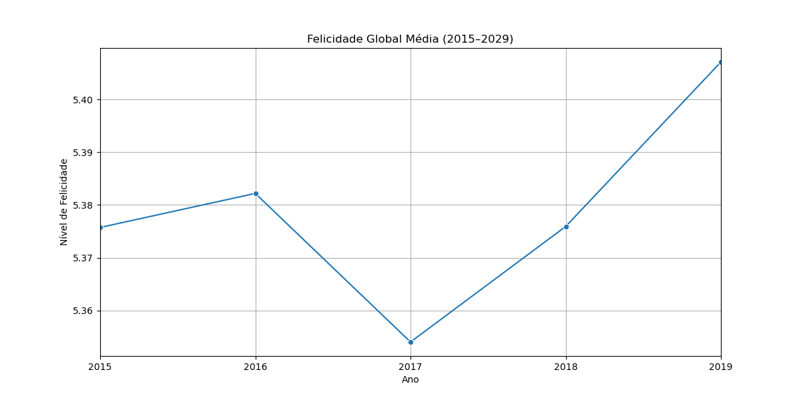
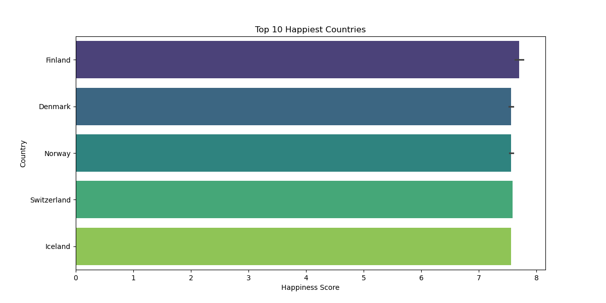
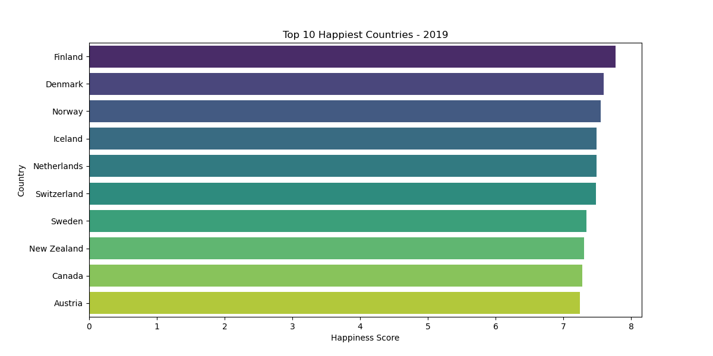
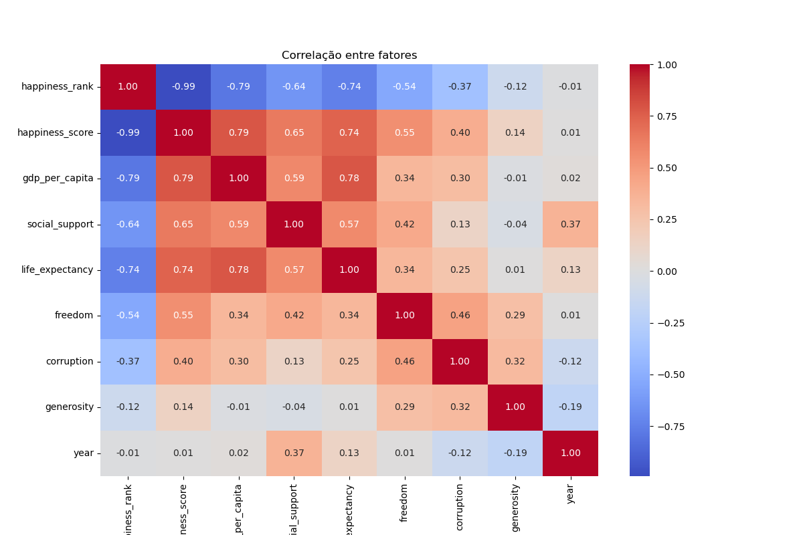
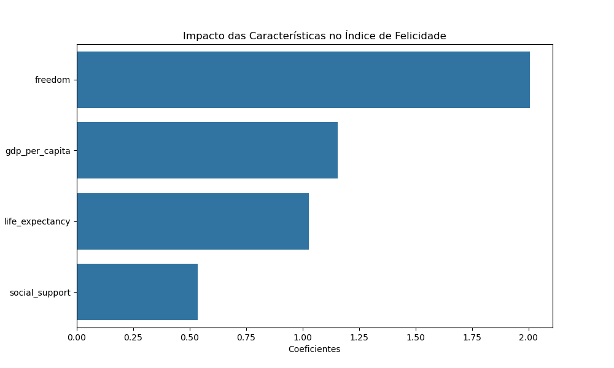

# Felicidade-Global
Análise da Felicidade Global utilizando Python. Projeto de Data Analysis.

# Resultados Atingidos

- **GDP per capita** Tem o maior índice na correlação medida.
- **Países da Europa Ocidental** dominam o ranking de top 10 países mais felizes.
- O modelo de geressão linear do indíce de felicidade obteve **R² = 0.74**.

Gráficos presentes nesta análise:

